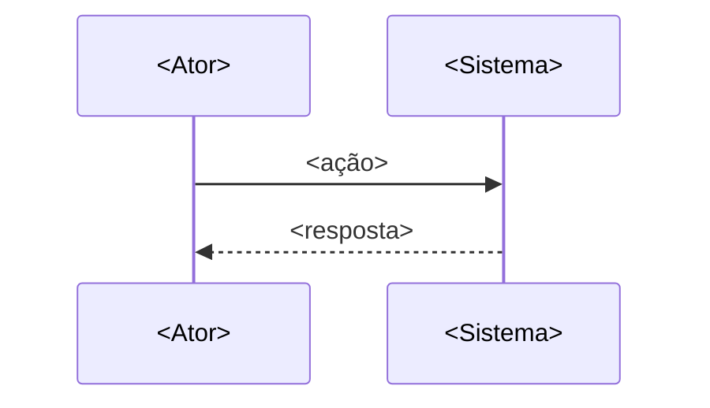
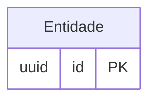

# RFC: <Título da decisão>

**Status:** Rascunho para revisão
**Data:** <YYYY-MM-DD>
**Autor:** Rafael Camillo / Impact X

<!-- opcional: callout de contexto/dado externo relevante, ex: > 📌 nota -->

---

## 1. Contexto

<!-- Qual é o problema real? Por que ele existe? Que evidência mostra que é real
(não hipótese)? O que soluções existentes não resolvem? 1 parágrafo denso. -->

---

## 2. Proposta

<!-- A solução recomendada, explicada em 1-2 parágrafos. Se houver dados/tabela
de apoio (preços, specs), incluir aqui. -->

### Abordagens consideradas

| Abordagem | Trade-off |
|---|---|
| **A. <recomendada> (recomendada)** | <por que ganha> |
| B. <alternativa> | <por que perde> |
| C. <alternativa> | <por que perde> |

**Recomendação: Abordagem A.** <justificativa curta — por que o trade-off vale a pena,
o que se aceita perder em troca do quê>.

---

## 3. Implementação

<!-- Use diagramas Mermaid quando ajudam a mostrar fluxo/dados — sequenceDiagram para
fluxos entre atores, flowchart para decisões condicionais, erDiagram para modelo de dados.
Omitir a subseção que não se aplicar. -->

### Fluxo principal

### Modelo de dados (se aplicável)

### Ordem de implementação

1. **<passo 1>** — <o quê>
2. **<passo 2>** — <o quê>
3. *(pós-MVP/depois)* <o que fica pra depois>

---

## 4. Riscos e Alternativas

<!-- Cada risco com sua mitigação. Inclua trade-offs descartados e por quê. -->

- **<risco 1>:** <descrição>. Mitigação: <o que fazer>.
- **<risco 2>:** <descrição>. Mitigação: <o que fazer>.
- **Alternativa descartada — <X>:** <por que não escolhida>.

---

## Ver também

- [[<pagina-contexto-relacionada>]]
- [[<prd-irmao-se-existir>]]

*Aguardando aprovação para início da implementação.*
