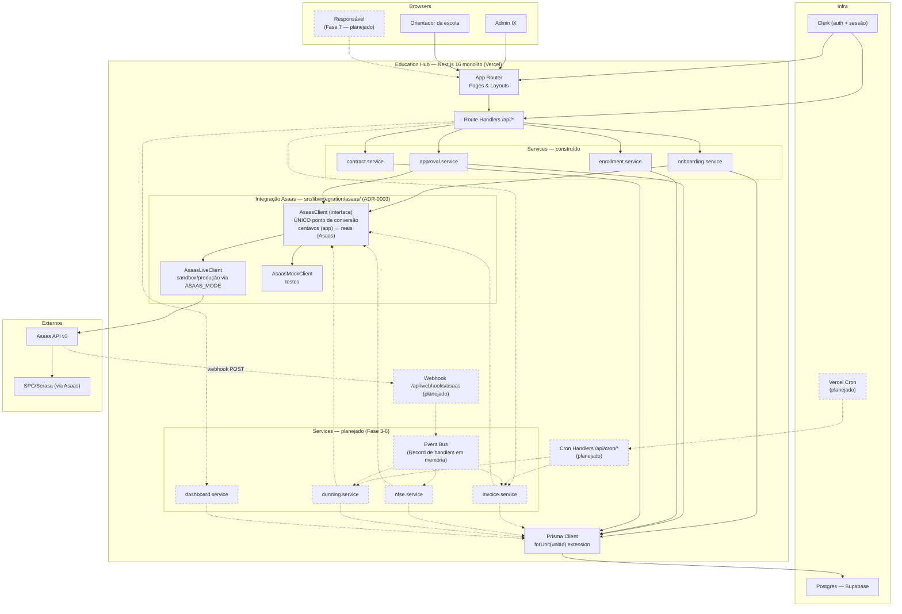
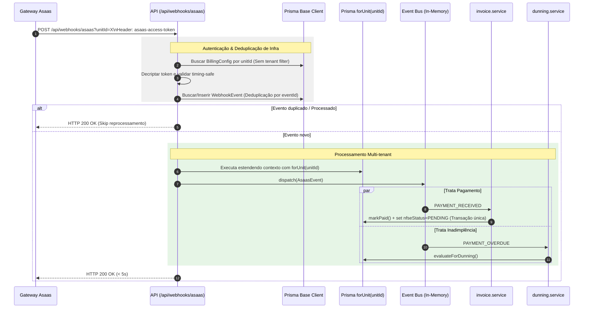

# System Design — MVP Education Hub

> **Status:** Referência viva, não é gate de lançamento. Cada feature continua sendo shipada por PR normal — este documento existe para que a arquitetura de hoje já acomode o backlog completo (Fases 0-9) sem exigir retrabalho estrutural quando cada fase entrar em construção.
> **Data:** 2026-08-22
> **Fontes:** blueprint de backend/infra (`system-architect`, usando skill `system-design-patterns`), blueprint de frontend (`feature-architect`, usando skill `frontend-system-design-patterns`), organizados aqui com o vocabulário de `api-design-patterns` para os contratos.
> **Critério não-negociável:** simplicidade. Cada corte de escopo abaixo nomeia o pattern rejeitado e o gatilho concreto que ainda não ocorreu — nunca "pode ficar lento" sem medição.

---

## 1. Mapa do backlog completo (Fases 0-9)

| Fase | O quê | Frontend | Backend | Infra | Estado |
|---|---|---|---|---|---|
| 0 | Fundação | — | Prisma schema, `forUnit()` | Next monolito, Clerk, Supabase | ✅ construído |
| 1 | Onboarding escola | Wizard | `onboarding.service`, `approval.service` | Asaas subconta | ✅ construído |
| 2 | Planos/matrícula | `/m/[token]/*` | `enrollment.service` | — | ✅ construído |
| 3 | Cobrança + webhook | — | `invoice.service`, webhook, event bus | cron billing | 🚧 blueprint pronto |
| 4 | NF + régua | — | `nfse.service` | cron diário (fundido com negativação) | 🚧 blueprint pronto |
| 5 | Negativação | UI 4-status (D0/D1) | `dunning.service` (nomeado, não detalhado) | — | ⬜ backend nomeado, UI a desenhar |
| 6 | Painel da escola | Dashboard, lista+detalhe cobranças | `dashboard.service` | — | 🚧 blueprint pronto |
| 7 | Portal responsável + cartão | Portal mobile, tela cartão | tokenização Asaas | — | ⬜ a desenhar |
| 8 | Saldo/saque/antecipação | Card saldo, modais | `getBalance`/`transfer`/antecipação | — | ⬜ a desenhar |
| 9 | Billing plataforma + CSV + settings | Settings 3 abas, import CSV | `PlatformPlan`/`PlatformInvoice` | — | ⬜ a desenhar |

As Fases 5, 7, 8, 9 não têm blueprint detalhado ainda (seção 6 explica por que a arquitetura atual já as acomoda sem retrabalho).

---

## 2. Big picture — componentes



**Nenhum service chama a API da Asaas diretamente** — todos passam por `AsaasClient` (ADR-0003, `src/lib/integration/asaas/`), que é o único lugar onde centavos (app) viram reais (Asaas) e vice-versa. `AsaasLiveClient` faz a chamada real (sandbox por padrão, produção só com confirmação explícita por operação — `.claude/rules/asaas.md`); `AsaasMockClient` responde em memória para testes. `onboarding.service`/`approval.service` já usam essa camada hoje (subconta, customer); `invoice.service`/`nfse.service`/`dunning.service` vão usá-la da mesma forma quando construídos — nenhuma integração nova, mesmo ponto único.

Linhas tracejadas e caixas pontilhadas = planejado, não construído. Linhas sólidas = em produção hoje.

---

## 3. Backend

### 3.1 Invoice — idempotência por constraint de banco

`Invoice` é a entidade-razão do ciclo financeiro. A unicidade da cobrança é garantida por **constraint de banco**, não por lógica de aplicação:

```
@@unique([enrollmentId, competencia])
```

`competencia` é o período que a invoice cobre (ex. `2026-09` para `MONTHLY`; `2026-09_2026-11` para `QUARTERLY`/`SEMIANNUAL`/`ANNUAL` — o schema já tem esses 4 valores em `EnrollmentPlan`, então "invoice do mês" não cobre 3 dos 4 planos).

O `externalReference` enviado à Asaas deriva da mesma chave, sem `Date.now()`:

```
edx-{unitId}-{enrollmentId}-{competencia}
```

**Achado a corrigir:** `.claude/rules/backend.md` hoje mostra `` `ed-${unitId}-${studentId}-${Date.now()}` `` no exemplo, contradizendo o próprio anti-padrão listado na mesma rule ("`externalReference` gerado aleatoriamente"). `Date.now()` quebra idempotência entre retries — é o bug, não o padrão a seguir.

**Padrão citado (skill `system-design-patterns`):** idempotency key, case Stripe — a chave é gerada uma vez por operação lógica, não por tentativa; retry retorna o resultado original. Aqui a chave deriva de dados estáveis (enrollment + competência), naturalmente estável entre retries.

**Consequência de simplicidade:** re-execução segura do cron elimina a necessidade de `BillingRun` bookkeeping e de lock de execução — rodar o cron duas vezes no mesmo dia não duplica cobrança, a segunda colide na constraint e pula.

**Índices obrigatórios** (regra `database.md` — hoje 6 models/12 referências a `unitId`, só 3 `@@index`, não aumentar a dívida): `@@index([unitId, status])`, `@@index([unitId, dueDate])`.

**Checklist obrigatório por model novo:** `Invoice` precisa entrar em `TENANT_MODELS` (`src/lib/db.ts`, lista hardcoded) — sem isso fica silenciosamente sem escopo de tenant. É o failure mode mais perigoso do ADR-0002 hoje e não tem proteção automática.

### 3.2 Webhook Asaas — contrato

Irreversível porque a URL é registrada por subconta no Asaas — mudar depois exige re-registrar em toda `Unit` já onboardada.

```
POST /api/webhooks/asaas?unitId={unitId}
Header: asaas-access-token: {token secreto da subconta}
```

`unitId` em query + token no header — exceção documentada à regra de ouro #7 (`unitId` sempre da sessão Clerk). Token vive em `BillingConfig.asaasWebhookTokenEnc` (AES-256-GCM, campo já existente no schema).

**Ordem de validação (a sequência importa):**



Emissão real de NFS-e **não acontece dentro do webhook** — `invoice.service` só marca `nfseStatus=PENDING` na mesma transação; o cron diário (3.4) varre pendências e retenta a chamada externa à Asaas fora do caminho crítico dos 5s de resposta ao webhook.

### 3.3 Event bus — sem fila

**Decision flow (skill `system-design-patterns`), passo 3: a versão chata resolve?** Sim — 5 tipos de evento, um processo, chamadas síncronas em memória. Um bus de verdade (fila, pub/sub, retry policy) resolveria um problema que não existe neste volume.

```ts
const handlers: Record<AsaasEventType, Handler[]>
```

Dispatch síncrono dentro da transação do webhook. Handlers se registram (NFS-e, dunning); nenhum edita o core do webhook (requisito `.claude/rules/asaas.md`).

### 3.4 NFS-e — durabilidade no banco, não no `after()`

O webhook persiste `Invoice.nfseStatus = PENDING` na mesma transação que marca `PAID`, e retorna 200. O **cron diário** varre `nfseStatus = PENDING` e retenta a emissão.

`after()`/`waitUntil` (Fluid Compute) são otimização de latência em cima disso — **não o mecanismo de garantia**. Falha dentro de `after()` depois do 200 é invisível e não retentada. A garantia é a linha no banco.

### 3.5 Cron — dois viram um, sem fan-out

**A aritmética:** pior caso ~300 enrollments por Unit num dia de fechamento, ~300-500ms por chamada Asaas, concorrência 5 → **~30s**. Teto de função: 300s (Fluid Compute, default). 30s cabe com margem de 10x — **fan-out não compra nada** e custa um hop HTTP interno mais segredo compartilhado.

Padrão: `Promise.allSettled` (não `.all` — uma escola com API key inválida não derruba a emissão das outras) com concorrência limitada, numa única invocação.

**`/api/cron/daily`** funde negativação + retry de NFS-e — as duas são varreduras diárias sobre estado no banco, um handler resolve as duas.

**Segunda exceção não-documentada à regra 7:** o cron também não tem sessão Clerk — autentica por `CRON_SECRET`, itera Units, e `forUnit(unitId)` é a fronteira de tenant também aqui. Precisa ficar escrito para não virar "correção" indevida num passe futuro de `security-auditor`.

### 3.6 O que fica irreversível (Gate 2 — pendente da sua assinatura)

1. **Chave `(enrollmentId, competencia)` do `Invoice`** — muda com dados reais só via migração com dinheiro envolvido.
2. **Formato do `externalReference`** — fica gravado do lado da Asaas.
3. **URL e header do webhook** — registrados por subconta.

**Decisões que precisam da sua assinatura:**
1. **CONFIRMED vs RECEIVED** — qual evento dispara PAID interno. Recomendação do blueprint: `RECEIVED` (já é a inclinação registrada no repo; defasagem de ~1 dia para boleto/PIX, custo baixo).
2. **Fluid Compute está ativo?** — decide 300s vs. 10s de teto (não muda a recomendação de invocação única, muda o mecanismo).
3. **Limites de contagem/frequência de cron do plano Vercel atual** — verificar antes de escrever `vercel.json`.
4. **Aprovar a correção do `Date.now()`** em `.claude/rules/backend.md` (contradiz o anti-padrão listado na mesma rule).

### 3.7 Cortes explícitos — pattern + gatilho ainda não ocorrido

| Cortado | Gatilho que justificaria adotar (ainda não ocorreu) |
|---|---|
| Fila dedicada (Redis/BullMQ) | Volume real quebrando a versão síncrona — linha MVP de `system-design-patterns`, *reject by default* |
| Circuit breaker (Netflix/Hystrix) | O padrão resolve cascata entre serviços; aqui há monolito + 1 provedor, `allSettled` + status `ERROR` já isolam — sem cascata, sem breaker |
| Outbox pattern | "DB commitou mas evento nunca publicou" **já ter causado** um bug — não causou, não há publisher externo |
| RLS no Postgres | ADR-0002 decidiu isolamento por aplicação para 10-50 tenants — nada mudou |
| `BillingRun` / lock de execução | Tornado desnecessário pela unique constraint de 3.1 |
| CQRS / event sourcing | Linha MVP, *reject by default* — trilha de auditoria não é requisito de produto aqui |
| Cache distribuído | Nenhum gargalo de leitura medido |

---

## 4. Frontend

### 4.1 RADIO aplicado ao Dashboard + Cobranças (Fase 6)

**Requirements:** 4 KPIs (recebido/a vencer/vencido/alunos ativos), tabela "próximos vencimentos", lista de cobranças filtrável, detalhe com ações (reenviar/cancelar), cobrança avulsa, extrato. **Relatórios avançados e Negativação saem desta fase** — `CLAUDE.md` do projeto já define isso como gatilho de upgrade Pro, não MVP Básico.

**Architecture:** RSC + Server Action é o padrão (não `useEffect`+`fetch` — anti-padrão já nomeado em `frontend.md`, presente em código antigo de `escolas/page.tsx`). Precedente correto já existe em `configuracoes/contrato/`.

```
Server Component (page.tsx)
  → getUnitContext() [unitId da sessão Clerk]
  → Service (invoice.service.ts) — Prisma com select explícito, já em centavos
  → Serializer (invoice.ts) — decripta/mascara PII, formata pra UI
  ↓ props (dados serializados, sem PII crua)
Client Component ("use client", só a tabela/filtros)
  → useState local: busca, filtro, página (ephemeral)
  → Server Action para mutations → revalidatePath
```

Sem camada de Store global — nenhum estado client-persistente precisa sobreviver a navegação nesta feature.

**Decisão de tabela (desvio da regra escrita, precisa aprovação/ADR):** `.claude/rules/frontend.md` manda TanStack Table v8. Verificado: `@tanstack/react-table` não está instalado; `src/components/DataTable.tsx` já existe e já é usado (`SchoolsTable.tsx`). Com page-size 6-8 e ≤300 linhas, sort/filter/paginação client-side em array é trivial. **Proposta:** estender `DataTable.tsx` (mover para `components/patterns/`, adicionar cabeçalho ordenável) em vez de introduzir TanStack para resolver um problema inexistente.

**Data model** — ver seção 5 (API), a mesma tabela de campos serve os dois.

**Interface** — Server Component consome o Service direto (sem round-trip HTTP interno); API Routes ficam reservadas pro webhook e qualquer consumo genuinamente externo.

**Optimizations, nomeadas por serem reais neste volume (50-300 alunos/escola):**
- Sem virtualização de lista — 300 linhas em memória é irrelevante.
- Sem cache client (TanStack Query/SWR) — dado server-originado, RSC busca uma vez, `revalidatePath` invalida.
- PII decriptada uma vez, no serializer (servidor) — nunca no client.
- `select` explícito no Prisma, índice composto `[unitId, status]`.
- **Divergência deliberada do mobile-first:** esta tela é ferramenta de admin/orientador, uso real em desktop (recepção da franquia). Segue o padrão do protótipo (`overflow-x-auto` + `min-width`), não vira cards no mobile — a superfície mobile-first genuína do produto é o portal do responsável (Fase 7) e o `/m/[token]`.

### 4.2 Como o resto do backlog se encaixa na mesma arquitetura

- **Fase 5 (Negativação UI):** reusa o mesmo padrão RSC+Server Action+`patterns/DataTable`, mais o `StatusBadge` já generalizado no blueprint (mapa único status→variant, criado para cobrança, reutilizável para os 4 status de negativação). O backend (`dunning.service`) já plugado no event bus da Fase 3-4 — a UI só consome o que o backend já expõe.
- **Fase 7 (Portal do responsável):** única fase que é genuinamente mobile-first (contrasta com 4.1) — mesma camada Component→Hook→Service, mesmo serializer de PII na borda, mas superfície de UI própria porque o usuário e o contexto de uso mudam.
- **Fase 8 (Saldo/saque/antecipação):** UI simples (card + modal) sobre `getBalance`/`transfer`/`requestAnticipation` do cliente Asaas já existente — nenhuma decisão de arquitetura nova, só integração pontual seguindo `asaas.md` (confirmação por operação).
- **Fase 9 (Billing plataforma + CSV + settings):** `PlatformInvoice` reusa o mesmo padrão de `Invoice` (idempotência, event bus) — é o mesmo motor de cobrança, com a escola como customer em vez do responsável. Import CSV é parser+validação isolado, sem impacto na arquitetura de camadas.

Nenhuma dessas 4 fases exige revisitar a decisão de `DataTable`/`StatusBadge`/RSC+Server Action já tomada na Fase 6 — é o mesmo vocabulário aplicado a entidades diferentes.

---

## 5. API — contratos

Vocabulário de `api-design-patterns`: recurso-cêntrico, não ação-cêntrica; idempotency key em toda mutation que toca Asaas; verbo HTTP com o significado convencional.

| Método | Rota | Uso | Idempotência |
|---|---|---|---|
| `GET` | `/api/cobrancas` | Listagem (Server Component consome direto o Service — rota exposta só se algum client externo precisar) | — |
| `GET` | `/api/cobrancas/{id}` | Detalhe | — |
| `POST` | `/api/cobrancas` | Cobrança avulsa | **Obrigatória** — toca Asaas |
| `POST` | `/api/cobrancas/{id}/reenviar` | Ação de estado, sub-resource (não `/reenviarCobranca`) | — |
| `DELETE` | `/api/cobrancas/{id}` | Cancelar | — |
| `POST` | `/api/webhooks/asaas` | Webhook (contrato em 3.2) | Dedup via `WebhookEvent.eventId` |

Todas (exceto webhook) exigem `unitId` da sessão Clerk via `getUnitContext()` — nunca de parâmetro.

**Modelo de dados que a UI consome** (campo → origem, ver `frontend-system-design-patterns` tabela de state):

| Campo | Tipo | Origem |
|---|---|---|
| `id`, `unitId` | string | servidor (unitId nunca exposto ao client) |
| `guardianName`, `studentNames` | string / string[] | servidor, decriptado no serializer |
| `amountCents` | int | servidor, centavos |
| `dueDate`, `paidAt` | ISO date | servidor |
| `status` | enum `PENDING\|PAID\|OVERDUE\|DISPUTED` | servidor |
| `paymentMethod` | enum `PIX\|BOLETO\|CARD` | servidor |
| `boletoLine`, `pixCopyPaste`, `invoiceUrl` | string \| null | servidor |

---

## 6. Infra

**Falta configurar:**

| Item | Onde | Justificativa |
|---|---|---|
| `crons` (2 entradas → fundidas em 1, ver 3.5) | `vercel.json` | Não existe hoje |
| `CRON_SECRET` | env + validação Zod no boot | Env faltando deve quebrar o boot, não virar `undefined` em produção |
| Rate limit em `/m/*` e endpoints públicos | Vercel Firewall | `.claude/rules/security.md` exige, não existe hoje. Token bucket generoso — tráfego de matrícula é burst legítimo, não ataque |
| Cache explícito nas rotas do dashboard | `dynamic = 'force-dynamic'` | Cache implícito é como dado de uma escola vaza pra outra |

Rollout de rate limit: `log` primeiro, revisar tráfego real, depois `deny` — não começar bloqueando sem dado.

---

## 7. Checklist de decisões pendentes (Gate 2)

- [ ] CONFIRMED vs RECEIVED — qual dispara PAID interno (recomendação: RECEIVED)
- [ ] Confirmar Fluid Compute ativo no plano Vercel (decide 300s vs 10s de teto de cron)
- [ ] Confirmar limites de contagem/frequência de cron do plano atual
- [ ] Aprovar correção do `Date.now()` em `.claude/rules/backend.md`
- [ ] Aprovar (ou abrir ADR para) o desvio de não trazer TanStack Table, estendendo `DataTable.tsx` existente
