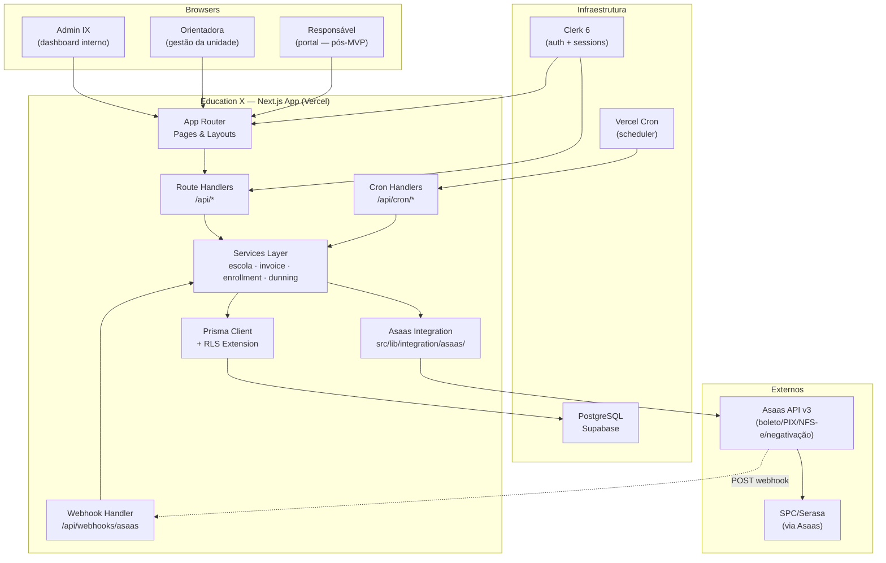
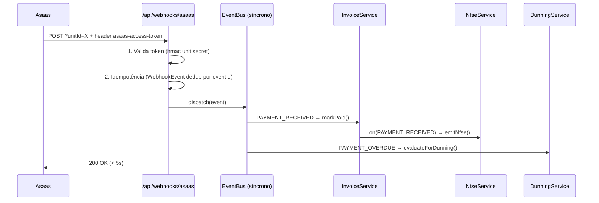
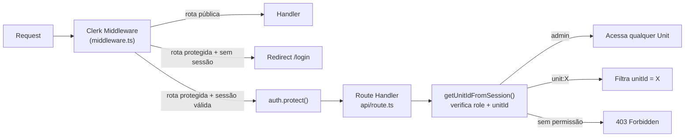
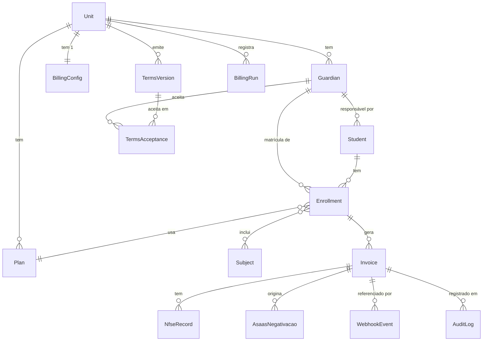

# System Design — Education X

> **Versão:** 1.0 · **Data:** 2026-06-12 · **Autor:** Coda (Engineering Lead, Impact X)
> **Status:** Aprovado — base de referência para desenvolvimento
> **Repo de código:** `~/ImpactX/education-x/`

---

## Índice

1. [Decisão de Arquitetura](#1-decisão-de-arquitetura)
2. [Visão Geral do Sistema](#2-visão-geral-do-sistema)
3. [Camadas da Aplicação](#3-camadas-da-aplicação)
4. [Integração Asaas](#4-integração-asaas)
5. [Multi-tenancy e Isolamento](#5-multi-tenancy-e-isolamento)
6. [Modelo de Dados](#6-modelo-de-dados)
7. [LGPD na Arquitetura](#7-lgpd-na-arquitetura)
8. [Escalabilidade](#8-escalabilidade)
9. [Segurança](#9-segurança)

---

## 1. Decisão de Arquitetura

### Contexto

A questão central é: **Next.js monolítico (Next-só)** ou **NestJS backend + Next.js frontend separados**.

O ponto de partida mais honesto: o código já existente (`~/ImpactX/education-x/`) é 100% Next-só. Há route handlers em `src/app/api/`, Clerk middleware em `src/middleware.ts`, serviços em `src/lib/services/`. Não há nenhuma base NestJS. A decisão, portanto, não é greenfield — é confirmar ou reverter a direção já tomada.

### Trade-offs

| Dimensão | Next-só (monolito modular) | NestJS + Next (separados) |
|---|---|---|
| **Deploys** | 1 app, 1 pipeline Vercel | 2 apps, 2 pipelines, 2 domínios |
| **Superfície** | Sem CORS, sem API gateway, sem service discovery | CORS obrigatório, headers Auth entre apps |
| **Crons** | Vercel Cron Jobs → route handlers (`/api/cron/*`) | Worker process autônomo (vantagem real) |
| **Webhooks** | Route handler `/api/webhooks/asaas` | Controller NestJS (mais estruturado) |
| **Disciplina de camadas** | Garantida por guideline (`Component→Hook→Store→Service→API`) | Garantida por decorators + DI do NestJS |
| **DX** | 1 repo, 1 `pnpm dev`, contexto compartilhado | 2 repos, 2 processos locais, mais setup |
| **Gargalo real** | Timeout de função serverless em cron de lote (mitigável) | Custo de manutenção de 2 apps com 1 founder |
| **Filosofia** | Alinhado com 37signals, baixa manutenção, sem competir com grandes | Over-engineering explícito — contraria D32 e a filosofia do produto |

### O contra-argumento honesto sobre crons e webhooks

A Education X tem carga não-trivial de trabalho assíncrono:
- Cron de emissão mensal em lote (Feature 2.1): gera boletos para todos os `Enrollment` ativos de todas as `Unit`
- Cron de negativação diário (Feature 3.3): verifica inadimplentes elegíveis
- Webhooks Asaas: volume proporcional ao número de cobranças pagas

O NestJS com Bull/BullMQ poderia processar filas com workers persistentes. Esse é o argumento real a favor da separação.

Mas a resposta é: **o problema existe em escala pequena por design**. Com 50–300 alunos por escola e 10–50 escolas no médio prazo, o volume é de centenas a alguns milhares de operações por ciclo. Vercel Cron suporta isso com a mitigação correta:

- **Fan-out por escola:** o cron dispara `N` chamadas paralelas, uma por `Unit`, cada uma com limite de alunos por execução
- **Idempotência via `WebhookEvent`:** eventos duplicados ou retries não causam efeitos colaterais
- **Chunking com cursor:** para escolas com muitos alunos, paginar em batches de 50 dentro do timeout

Esse é o limite do modelo — documentado, não escondido. Se o produto crescer para milhares de escolas simultâneas, uma fila dedicada (Redis + BullMQ) pode ser adicionada como serviço lateral sem exigir separação do backend.

### Decisão

**Next-só (monolito modular)**. Justificativas:

1. O código existente já segue essa arquitetura — reverter é custo sem benefício no estágio atual
2. A disciplina de camadas vem dos guidelines IX, não precisa do NestJS para ser imposta
3. Um founder + um vendedor não sustenta operação de dois deploys
4. Os volumes previstos cabem nos limites do Vercel Cron com fan-out e chunking
5. Alinhado às decisões duras D1 (sem abstração multi-provider), D32 (recomeço limpo) e filosofia 37signals

---

## 2. Visão Geral do Sistema

### Diagrama de componentes



### Fluxo de dados — cobrança mensal

```
VercelCron (dia 25 às 06:00 BRT)
  → GET /api/cron/billing
  → BillingService.runMonthlyBatch()
  → Para cada Unit ativa:
      → Para cada Enrollment ativo:
          → Calcula valor (plan + subjects + pro-rata)
          → AsaasClient.createPayment(unitApiKey, payload)
          → Persiste Invoice (status=PENDING)
          → Asaas envia email/WhatsApp/SMS ao Guardian

Asaas processa pagamento
  → POST /api/webhooks/asaas?unitId=UNIT_ID
  → Valida token (header asaas-access-token)
  → Idempotência (WebhookEvent dedup)
  → InvoiceService.markPaid(invoiceId)
  → NfseService.emit(invoiceId)
```

---

## 3. Camadas da Aplicação

O sistema segue a hierarquia de camadas rígida definida nos guidelines IX. Cada camada tem responsabilidade exclusiva; violações são bloqueadas no code review.

```
┌─────────────────────────────────────────────┐
│  Component (React Server/Client Components) │ UI + composição visual
├─────────────────────────────────────────────┤
│  Hook (custom React hooks)                  │ Estado local, side effects de UI
├─────────────────────────────────────────────┤
│  Store (Zustand 5)                          │ Estado global de sessão/UI
├─────────────────────────────────────────────┤
│  Service (src/lib/services/)                │ Lógica de negócio, orquestração
├─────────────────────────────────────────────┤
│  API (src/app/api/ route handlers)          │ Contrato HTTP, validação de entrada
└─────────────────────────────────────────────┘
```

### Responsabilidades por camada

| Camada | Responsabilidade | Proibido |
|---|---|---|
| **Component** | Renderizar UI, chamar hooks, emitir eventos | Chamar Prisma, chamar Asaas, lógica de negócio |
| **Hook** | Encapsular fetch/mutation, gerenciar loading/error local | Lógica de negócio, acesso direto ao banco |
| **Store** | Estado de sessão (unit selecionada, preferências UI) | Fetch de dados (isso é hook), lógica de negócio |
| **Service** | Orquestrar banco + Asaas, calcular valores, validar invariantes | Conhecer HTTP, retornar `Response` objects |
| **API** | Validar auth (Clerk), parsear/validar input (Zod), chamar service, formatar response | Lógica de negócio direta |

### Convenções de arquivo

```
src/
├── app/
│   ├── (app)/            # Rotas autenticadas (group layout com Clerk)
│   │   ├── dashboard/
│   │   ├── units/
│   │   ├── guardians/
│   │   ├── students/
│   │   ├── invoices/
│   │   └── enrollments/
│   ├── (auth)/           # Login, registro (público)
│   └── api/
│       ├── webhooks/asaas/    # Webhook Asaas (público, auth por token)
│       ├── cron/billing/      # Cron emissão mensal
│       ├── cron/dunning/      # Cron negativação diário
│       ├── units/
│       ├── invoices/
│       └── ...
├── components/
│   ├── ui/               # ÁTOMOS — shadcn (locais, não npm) + tokens Alfabeto
│   ├── patterns/         # MOLÉCULAS/ORGANISMOS reutilizáveis (DataTable, FormField, PageHeader, StatusBadge, MetricCard…)
│   └── [feature]/        # Composição de feature (usa patterns + ui, não recria)
├── lib/
│   ├── db.ts             # Prisma client singleton
│   ├── services/         # Lógica de negócio
│   └── integration/
│       └── asaas/        # Cliente Asaas (interface + live + mock)
└── middleware.ts          # Clerk auth guard
```

---

### 3.1 Arquitetura de UI — Atomic Design + reuso obrigatório

> **Regra inegociável:** antes de criar qualquer componente, verificar se já existe em `ui/` ou `patterns/`. **Zero duplicação.** Um botão, uma tabela, um card — uma implementação só, reusada. Isso é o que sustenta "baixa manutenção".

**Hierarquia (Atomic Design):**

| Nível | Mora em | Exemplos | Regra |
|-------|---------|----------|-------|
| **Átomos** | `components/ui/` | Button, Input, Badge, Select, Checkbox, Dialog | shadcn estilizado com tokens Alfabeto. Não reimplementar — usar o shadcn. |
| **Moléculas/Organismos** | `components/patterns/` | DataTable, FormField, SearchBar, PageHeader, StatusBadge, MetricCard, EmptyState, Stepper | Composições reutilizáveis nossas. Toda tela puxa daqui. |
| **Templates/Páginas** | `components/[feature]/` + `app/` | OnboardingWizard, InvoiceList, NegativacaoPanel | Compõem patterns + átomos. **Nunca recriam** um botão/tabela inline. |

**O protótipo é referência de LAYOUT e FLUXO, não de implementação.** O protótipo (`design-handoff/`) foi feito para validar visual rápido, então **repete código** — cada tela tem sua tabela/card inline, e tabelas divergem entre telas. Na produção: seguir o **layout e o comportamento** que o protótipo mostra, mas implementar com **um** componente reutilizável parametrizado. Se duas telas do protótipo têm tabelas visualmente diferentes, ambas viram **configurações do mesmo `DataTable`**, não duas tabelas.

### 3.2 DataTable — um organismo para todas as ~8 tabelas

O componente mais repetido no protótipo (aparece em ~8 telas: matrículas, cobranças, negativação, extrato, faturas, etc.). **Decisão: um único `DataTable` headless sobre TanStack Table** + wrapper visual Alfabeto.

- **Motor:** [TanStack Table](https://tanstack.com/table) (headless) — ordenação, filtro, paginação como padrão de mercado, menos código nosso. Consultar `context7` para a API atual na implementação (cutoff do modelo pode estar defasado).
- **Wrapper:** `components/patterns/DataTable.tsx` — recebe `columns`, `data`, `filters`, `pageSize` por props; aplica o padrão visual obrigatório do protótipo (ver `design-handoff/project/CLAUDE.md`): título+ação, barra de filtros (busca + segmented), cabeçalhos ordenáveis com ícone, valores categóricos como `<Badge>`, paginação sempre visível, estado vazio, responsivo.
- **Cada tabela do produto = uma definição de `columns` + config.** Nunca uma `<table>` inline nova.

```
components/patterns/DataTable.tsx          # wrapper visual único (TanStack + Alfabeto)
app/(app)/invoices/_columns.ts             # def de colunas da tela
app/(app)/enrollments/_columns.ts          # def de colunas da tela
…                                          # uma def por tela, zero tabela duplicada
```

### 3.3 Responsividade — regra, não improviso

**Mobile-first.** Breakpoints fixos (os mesmos do Playwright/quality gate):

| Breakpoint | Largura | Alvo |
|------------|---------|------|
| Mobile | 375px | Portal do responsável (mobile-first), matrícula via link |
| Tablet | 768px | Painel da escola adaptado |
| Desktop | 1440px | Painel da escola (uso principal do Orientador) |

**Comportamento responsivo por tipo de componente (definido, não ad-hoc):**
- **DataTable** → no mobile, vira lista de cards (uma linha = um card) OU scroll horizontal com `min-width` (decidir por densidade da tabela). Nunca espreme colunas ilegíveis.
- **Sidebar** → colapsa em drawer/hambúrguer no mobile/tablet.
- **Wizard (onboarding, matrícula)** → um passo por tela no mobile; campos empilham.
- **MetricCard grid** → 4 colunas desktop → 2 tablet → 1 mobile.
- **Modais** → full-screen no mobile, centered no desktop.

**Gate:** todo PR com UI passa pelo Playwright nos 3 breakpoints (já no quality gate). Tela que quebra em qualquer breakpoint não sobe.

---

## 4. Integração Asaas

### Arquitetura do cliente

O cliente Asaas segue o **padrão strategy**: uma interface comum (`AsaasClient`) com duas implementações — `AsaasLiveClient` (produção/sandbox real) e `AsaasMockClient` (testes, desenvolvimento local). A seleção é feita por variável de ambiente `ASAAS_MODE=mock|live`.

```
AsaasClient (interface)
├── AsaasLiveClient    → HTTP real para api.asaas.com / sandbox.asaas.com
└── AsaasMockClient    → Respostas determinísticas em memória (65 testes, 96% cobertura)
```

**Ponto crítico de conversão:** a Asaas trabalha com **reais (Float)**; o banco armazena em **centavos (Int)**. A conversão acontece exclusivamente na borda do `AsaasLiveClient`:

```
Banco (Int centavos) → Service → AsaasLiveClient → divide por 100 → Asaas API (Float reais)
Asaas API (Float reais) → AsaasLiveClient → multiplica por 100 → round → Service → Banco (Int centavos)
```

Nenhuma outra camada manipula essa conversão. O `AsaasMockClient` já opera em centavos.

> **Debt atual:** o schema Prisma usa `amount Float`. Antes de ir para produção, migrar para `amount Int` (centavos). Isso é uma breaking change de schema que exige migration explícita.

### Hierarquia de contas

```
Conta mestre IX (ASAAS_MASTER_API_KEY)
│
└── Subconta por Unit
      ├── apiKey único (criptografado no banco)
      ├── walletId
      └── webhookSecret único (criptografado no banco)
```

A conta mestre é usada apenas para criar subcontas (onboarding). Toda operação posterior usa o `apiKey` da `Unit`. O `getMasterAsaasClient()` nunca é chamado fora do serviço de onboarding.

### Webhooks — event bus



**Eventos escutados:**

| Evento Asaas | Handler | Efeito |
|---|---|---|
| `PAYMENT_CREATED` | `InvoiceService` | Registra `asaasPaymentId` se criado externamente |
| `PAYMENT_RECEIVED` | `InvoiceService` + `NfseService` | `Invoice.status = RECEIVED` + emite NFS-e |
| `PAYMENT_CONFIRMED` | `InvoiceService` | `Invoice.status = CONFIRMED` (cartão — pós-MVP) |
| `PAYMENT_OVERDUE` | `DunningService` | Marca vencida, entra na régua |
| `PAYMENT_REFUNDED` | `InvoiceService` | `Invoice.status = REFUNDED` |

**Idempotência:** cada evento é gravado em `WebhookEvent(eventId, processedAt)`. Antes de processar, o handler verifica se `eventId` já existe. Se sim, retorna `200 OK` sem reprocessar. A Asaas usa `sendType: SEQUENTIALLY` — enfileira retries, não atropela.

### Crons

Dois crons operacionais, configurados em `vercel.json`:

**Cron 1: Emissão mensal** — executa às 06:00 BRT do dia de fechamento de cada `Unit` (configurável).

```
GET /api/cron/billing
Authorization: Bearer CRON_SECRET (Vercel passa automaticamente)

Algoritmo:
1. Lista Units com fechamentoDia == hoje
2. Para cada Unit (fan-out paralelo, Promise.allSettled):
   a. Lista Enrollments ativos com Invoice do mês não emitido
   b. Para cada Enrollment (batch de 50):
      - Calcula valor (plan + subjects + pro-rata)
      - AsaasClient.createPayment()
      - INSERT Invoice (status=PENDING)
   c. Grava BillingRun (unit, batchDate, succeeded, failed)
3. Retorna resumo
```

**Cron 2: Negativação diária** — executa às 07:00 BRT todos os dias.

```
GET /api/cron/dunning
Authorization: Bearer CRON_SECRET

Algoritmo:
1. Lista DunningNotices prontos para negativar (noticeSentAt + aviso_days <= hoje)
2. Para cada caso elegível:
   - AsaasClient.createNegativacao(cpf, invoiceId)
   - UPDATE AsaasNegativacao.status = NEGATIVATED
3. Lista AsaasNegativacoes pendentes de aviso:
   - Responsáveis com Invoice OVERDUE >= dunning_threshold_days
   - Envia aviso prévio (email + WhatsApp + SMS via Asaas)
   - INSERT DunningNotice (noticeSentAt = now)
4. Retorna log de ações
```

---

## 5. Multi-tenancy e Isolamento

### Modelo de isolamento

O Education X usa **isolamento por aplicação** (não RLS no banco): cada query ao Prisma filtra explicitamente por `unitId` derivado da sessão Clerk. Não há row-level security no PostgreSQL — a responsabilidade de isolamento fica na camada de serviço.

Isso é adequado para o porte atual. Se a base de clientes crescer para centenas de unidades, RLS pode ser adicionado como camada extra sem mudança de arquitetura.

### Três trust boundaries

```
┌──────────────────────────────────────────────────────┐
│  Admin IX (role: admin)                              │
│  Acesso: todas as Units, todos os Guardians,         │
│  histórico de aceites, configuração global           │
├──────────────────────────────────────────────────────┤
│  Orientadora — Fran-Unit (role: unit:UNIT_ID)        │
│  Acesso: apenas sua Unit, seus Guardians/Students,   │
│  seus Invoices, suas configurações de cobrança       │
├──────────────────────────────────────────────────────┤
│  Público (sem auth)                                  │
│  Acesso: /api/health, /api/webhooks/asaas (token),   │
│  /login, /register                                   │
└──────────────────────────────────────────────────────┘
```

### Fluxo de autenticação e autorização



### Prevenção de vazamento cross-escola

**Regra:** todo `prisma.*.findMany()` de entidades relacionadas à unidade DEVE incluir `where: { unitId }`. O `unitId` vem sempre da sessão Clerk, nunca de parâmetro HTTP.

```typescript
// CORRETO
const invoices = await db.invoice.findMany({
  where: { unitId: session.unitId, id: invoiceId }
})

// ERRADO (nunca fazer)
const invoices = await db.invoice.findMany({
  where: { id: req.params.invoiceId }  // sem filtro de unit
})
```

Toda rota de API usa um helper `getUnitContext(auth)` que retorna `{ unitId, role }` e lança `403` se a sessão não tiver permissão para o recurso solicitado.

---

## 6. Modelo de Dados

> **Nota sobre nomenclatura:** as entidades usam nomes em inglês como alvo de design (alinhado ao `unitId` já em uso no webhook e à decisão D32 de recomeço). O schema Prisma atual usa nomes em português (`Escola`, `Responsavel`) e é parcial — faltam entidades listadas abaixo. A migração para os nomes definitivos deve acontecer antes da entrada em produção.

### Entidades e relações



### Descrição das entidades

**Unit** — A unidade escolar (franquia Kumon, Wizard etc.). Corresponde a uma subconta Asaas.

| Campo | Tipo | Notas |
|---|---|---|
| `id` | `String` (cuid) | PK |
| `name` | `String` | Nome da escola |
| `cnpj` | `String` (unique) | PII — não criptografado (CNPJ é público) |
| `email` | `String` (unique) | Contato administrativo |
| `phone` | `String?` | |
| `asaasAccountId` | `String?` | ID da subconta Asaas |
| `asaasApiKeyEncrypted` | `String?` | **AES-256-GCM** — nunca plaintext |
| `asaasWalletId` | `String?` | |
| `status` | `Enum` | `PENDING \| ACTIVE \| SUSPENDED` |

**BillingConfig** — Configurações financeiras da unidade (1:1 com Unit).

| Campo | Tipo | Notas |
|---|---|---|
| `multaPercent` | `Float` | Padrão 2% |
| `jurosPercent` | `Float` | Padrão 1%/mês |
| `diasVencimento` | `Int` | Dias após fechamento para vencimento |
| `fechamentoDia` | `Int` | Dia do mês do fechamento |
| `nfseAtiva` | `Boolean` | NFS-e automática após pagamento |
| `nfseInscricaoMunicipal` | `String?` | Inscrição municipal para NFS-e |
| `asaasWebhookSecret` | `String?` | **AES-256-GCM** |
| `dunningEnabled` | `Boolean` | Negativação automática ligada/desligada |
| `dunningThresholdDays` | `Int` | Dias de atraso para iniciar fluxo |
| `dunningNoticeAdvanceDays` | `Int` | Dias de aviso prévio obrigatório (mín 5) |
| `dunningMinAmount` | `Int` | Valor mínimo em centavos (mín 5000) |

**Guardian** — O responsável financeiro (pai/mãe/responsável). PII sensível.

| Campo | Tipo | Notas |
|---|---|---|
| `unitId` | `String` | FK → Unit (isolamento obrigatório) |
| `name` | `String` | PII |
| `cpfEncrypted` | `String` | **AES-256-GCM** — obrigatório para negativação |
| `emailEncrypted` | `String` | **AES-256-GCM** |
| `phoneEncrypted` | `String?` | **AES-256-GCM** |
| `asaasCustomerId` | `String?` | ID do cliente na subconta Asaas |
| `addressJson` | `Json?` | Endereço em JSON — PII |
| `isActive` | `Boolean` | |

> **Atenção LGPD:** `cpf`, `email` e `phone` são dados pessoais diretos. Devem ser criptografados no banco (AES-256-GCM). Ver seção 7.

**Student** — O aluno matriculado. Dado de menor (proteção adicional LGPD/ECA).

| Campo | Tipo | Notas |
|---|---|---|
| `unitId` | `String` | FK → Unit |
| `guardianId` | `String` | FK → Guardian (responsável) |
| `nameEncrypted` | `String` | **AES-256-GCM** — dado de menor |
| `birthDateEncrypted` | `String?` | **AES-256-GCM** — dado de menor |
| `isActive` | `Boolean` | |

**Subject** — Disciplina/matéria ofertada pela unidade (ex: Matemática Kumon, Português Kumon).

| Campo | Tipo | Notas |
|---|---|---|
| `unitId` | `String` | FK → Unit |
| `name` | `String` | Nome da matéria |
| `priceInCents` | `Int` | Valor em centavos |
| `isActive` | `Boolean` | |

**Plan** — Plano de pagamento da unidade (mensal, trimestral, semestral, anual).

| Campo | Tipo | Notas |
|---|---|---|
| `unitId` | `String` | FK → Unit |
| `name` | `String` | Ex: "Mensal Kumon" |
| `periodicity` | `Enum` | `MONTHLY \| QUARTERLY \| SEMIANNUAL \| ANNUAL` |
| `baseAmountInCents` | `Int` | Valor-base em centavos |
| `isActive` | `Boolean` | |

**Enrollment** — A matrícula ativa de um aluno em um plano. Gera Invoices mensalmente.

| Campo | Tipo | Notas |
|---|---|---|
| `unitId` | `String` | FK → Unit |
| `guardianId` | `String` | FK → Guardian |
| `studentId` | `String` | FK → Student |
| `planId` | `String` | FK → Plan |
| `subjectIds` | `String[]` | Relação N:N com Subject |
| `startDate` | `DateTime` | Início da matrícula (pro-rata entrada) |
| `endDate` | `DateTime?` | Encerramento (pro-rata saída) |
| `status` | `Enum` | `ACTIVE \| CANCELLED \| SUSPENDED` |

**Invoice** — Uma cobrança gerada para um Guardian. Central do sistema financeiro.

| Campo | Tipo | Notas |
|---|---|---|
| `unitId` | `String` | FK → Unit |
| `enrollmentId` | `String` | FK → Enrollment |
| `guardianId` | `String` | FK → Guardian |
| `amountInCents` | `Int` | **Centavos** — nunca Float |
| `dueDate` | `DateTime` | Vencimento |
| `billingType` | `String` | `BOLETO` (inclui PIX embutido) |
| `asaasPaymentId` | `String?` | ID na Asaas (unique) |
| `status` | `Enum` | `PENDING \| RECEIVED \| CONFIRMED \| OVERDUE \| REFUNDED \| CANCELLED` |
| `paidAt` | `DateTime?` | Data do pagamento |
| `paidAmountInCents` | `Int?` | Valor pago em centavos |
| `boletoUrl` | `String?` | URL do boleto |
| `pixCopiaECola` | `String?` | Código PIX |
| `referenceMonth` | `DateTime` | Mês de referência da cobrança |

**NfseRecord** — Nota Fiscal de Serviço Eletrônica emitida após pagamento.

| Campo | Tipo | Notas |
|---|---|---|
| `invoiceId` | `String` | FK → Invoice (1:1 por emissão) |
| `asaasInvoiceId` | `String?` | ID na Asaas |
| `status` | `Enum` | `PENDING \| AUTHORIZED \| ERROR \| CANCELLED` |
| `number` | `String?` | Número da nota |
| `pdfUrl` | `String?` | Link do PDF |

> **Retenção LGPD:** NFS-e tem retenção obrigatória de 5 anos (Lei Complementar 116/2003). Dados de NfseRecord não podem ser anonimizados.

**AsaasNegativacao** — Registro de negativação SPC/Serasa via Asaas.

| Campo | Tipo | Notas |
|---|---|---|
| `invoiceId` | `String` | FK → Invoice |
| `guardianId` | `String` | FK → Guardian |
| `status` | `Enum` | `NOTICE_PENDING \| NOTICE_SENT \| NEGATIVATED \| REGULARIZED \| CANCELLED` |
| `noticeSentAt` | `DateTime?` | Timestamp do aviso prévio (prova legal CDC art. 43) |
| `negativatedAt` | `DateTime?` | Timestamp da negativação |
| `regularizedAt` | `DateTime?` | Timestamp da baixa |
| `asaasNegativacaoId` | `String?` | ID retornado pela Asaas |

> **Retenção LGPD:** registros de negativação têm retenção obrigatória (prova legal + SPC/Serasa requer histórico).

**TermsVersion** — Versão de termos de uso emitida pela unidade.

| Campo | Tipo | Notas |
|---|---|---|
| `unitId` | `String` | FK → Unit |
| `type` | `Enum` | `SCHOOL_TERMS \| GUARDIAN_TERMS` |
| `version` | `String` | Ex: "2026-01" |
| `contentHash` | `String` | SHA-256 do conteúdo (prova de integridade) |
| `effectiveAt` | `DateTime` | Data de vigência |

**TermsAcceptance** — Aceite clickwrap registrado. Válido por MP 2.200-2 + Lei 14.063 + STJ.

| Campo | Tipo | Notas |
|---|---|---|
| `termsVersionId` | `String` | FK → TermsVersion |
| `guardianId` | `String` | FK → Guardian |
| `ip` | `String` | IP do aceite (prova legal) |
| `userAgent` | `String` | Browser/device (prova legal) |
| `acceptedAt` | `DateTime` | Timestamp do clique |

**WebhookEvent** — Deduplicação de eventos Asaas.

| Campo | Tipo | Notas |
|---|---|---|
| `eventId` | `String` (unique) | ID do evento Asaas |
| `unitId` | `String` | FK → Unit |
| `eventType` | `String` | Ex: `PAYMENT_RECEIVED` |
| `processedAt` | `DateTime` | |

**AuditLog** — Log de auditoria de ações sensíveis.

| Campo | Tipo | Notas |
|---|---|---|
| `entityType` | `String` | Ex: `Invoice`, `Guardian`, `Enrollment` |
| `entityId` | `String` | ID da entidade |
| `action` | `String` | Ex: `CREATE`, `UPDATE`, `DELETE`, `MARK_PAID` |
| `changes` | `Json` | Diff antes/depois (sem PII plaintext) |
| `userId` | `String?` | Clerk user ID |
| `unitId` | `String?` | Para queries por unidade |

---

## 7. LGPD na Arquitetura

### Mapa de PII e base legal por operação

| Dado | Entidade | Base legal (LGPD art. 7º) | Retenção | Criptografado |
|---|---|---|---|---|
| Nome do responsável | `Guardian.name` | Execução de contrato (inciso V) | Duração do contrato + 5 anos | Não (necessário para UI) |
| CPF do responsável | `Guardian.cpfEncrypted` | Execução de contrato + obrigação legal (negativação) | 5 anos após fim do contrato | **Sim (AES-256-GCM)** |
| Email do responsável | `Guardian.emailEncrypted` | Execução de contrato | 5 anos após fim do contrato | **Sim (AES-256-GCM)** |
| Telefone do responsável | `Guardian.phoneEncrypted` | Execução de contrato | 5 anos após fim do contrato | **Sim (AES-256-GCM)** |
| Nome do aluno (menor) | `Student.nameEncrypted` | Execução de contrato + tutela (ECA) | Duração matrícula + 5 anos | **Sim (AES-256-GCM)** |
| Data de nascimento (menor) | `Student.birthDateEncrypted` | Execução de contrato | Duração matrícula + 5 anos | **Sim (AES-256-GCM)** |
| API key da escola | `Unit.asaasApiKeyEncrypted` | Execução de contrato | Duração do contrato | **Sim (AES-256-GCM)** |
| Dados de NFS-e | `NfseRecord` | Obrigação legal (LC 116/2003) | 5 anos obrigatório | Não (dados fiscais públicos) |
| Registro de negativação | `AsaasNegativacao` | Obrigação legal (CDC art. 43) | 5 anos obrigatório | Não (dado de prova legal) |
| IP + UserAgent de aceite | `TermsAcceptance` | Legítimo interesse + prova legal | 5 anos obrigatório | Não (dado de prova legal) |

### Anonimização vs. retenção legal

A LGPD permite excluir/anonimizar dados após o término da finalidade. Porém, duas classes de dados têm **retenção obrigatória por legislação setorial** que prevalece sobre o pedido de exclusão:

- **NFS-e:** retenção 5 anos (Lei Complementar 116/2003 + Código Tributário Nacional)
- **Registros de negativação + avisos prévios:** retenção 5 anos (CDC + jurisprudência de disputas)
- **Aceites clickwrap:** retenção enquanto houver contrato ativo + 5 anos (prova em eventual litígio)

Para pedidos de exclusão de dados (LGPD art. 18, inciso VI):
1. Anonimizar campos de PII (nome, CPF, email, telefone) substituindo por hash irreversível
2. Preservar NfseRecord, AsaasNegativacao e TermsAcceptance com o ID anonimizado
3. Registrar a anonimização no AuditLog com base legal citada

### Criptografia de PII em repouso

Todos os campos marcados como criptografados usam **AES-256-GCM** com:
- Chave mestra de 32 bytes em `ENCRYPTION_KEY` (env var — nunca no banco ou código)
- IV único de 12 bytes por cifração (gerado via `crypto.randomBytes`)
- Auth tag de 16 bytes (garante integridade — detecta adulteração)
- Armazenamento: `base64(IV || AuthTag || CipherText)` em campo `String` do banco

A implementação está em `src/lib/services/escola.service.ts` (funções `encryptApiKey` / `decryptApiKey`) e deve ser extraída para `src/lib/crypto.ts` como utilitário genérico antes do MVP.

### Log de auditoria

Toda ação sensível gera entrada em `AuditLog`:
- Criação/edição de Guardian ou Student
- Criação/cancelamento de Invoice ou Enrollment
- Marcação de pagamento
- Envio de aviso de negativação
- Efetivação ou baixa de negativação
- Aceite de termos

O `changes` no AuditLog armazena diff (antes/depois) mas **nunca PII em plaintext** — apenas referências por ID ou campos não-PII.

---

## 8. Escalabilidade

### Escala por design

O Education X opera com escala **deliberadamente pequena**: 50–300 alunos por unidade, 10–50 unidades no médio prazo. Esta não é uma limitação técnica — é uma decisão de negócio (filosofia 37signals, D32). Over-engineering para escala maior é explicitamente fora de escopo.

### Onde o sistema cresce

| Vetor de crescimento | Volume estimado (50 unidades × 200 alunos) | Estratégia |
|---|---|---|
| Cron de emissão mensal | 10.000 `createPayment` em ~2h | Fan-out por unidade + batch de 50 por execução |
| Webhooks concorrentes | Pico no dia de fechamento: ~500 eventos/hora | Idempotência + Asaas sequential mode |
| Queries de dashboard | Paginação padrão 20 itens | Índices em `unitId + status + dueDate` |
| Banco de dados | ~500k registros em 2 anos | PostgreSQL suporta; sem sharding necessário |

### Gargalos previsíveis e mitigações

**Gargalo 1: Timeout do cron de emissão em lote**

- Risco: cron de emissão mensal com muitas unidades pode ultrapassar 60s (limite Vercel serverless)
- Mitigação: o cron não processa tudo em uma execução. Ele itera por `Unit` e, para cada uma, dispara um job interno via `fetch('/api/cron/billing/unit/UNIT_ID')` — requisições paralelas independentes com timeout próprio. O cron principal apenas agenda e coleta resultados.
- Fallback: `BillingRun` registra o estado de cada execução. A Orientadora pode disparar manualmente (`POST /api/units/:id/billing/force`) via UI.

**Gargalo 2: Rate limit da Asaas**

- A Asaas aplica rate limit por `apiKey`
- Mitigação: cada `Unit` tem seu próprio `apiKey` (subconta) — o rate limit não é compartilhado entre escolas. Sem problema até dezenas de unidades.

**Gargalo 3: Crescimento do banco**

- `AuditLog` cresce sem limite por padrão
- Mitigação: política de retenção de 2 anos para `AuditLog` (não é dado fiscal, apenas operacional). Cron semanal de limpeza.

### O que NÃO implementar agora

- Filas Redis/BullMQ (volume não justifica)
- Cache distribuído (Supabase tem connection pooling suficiente)
- CDN para assets dinâmicos (PDFs de NFS-e ficam na Asaas)
- Multi-region (Vercel + Supabase em BRT já)
- Microserviços (nenhum vetor de escala justifica a fragmentação)

---

## 9. Segurança

### Criptografia de credenciais externas

**API keys das unidades (Asaas):**
- Armazenadas como `AES-256-GCM` em `Unit.asaasApiKeyEncrypted`
- A chave mestra `ENCRYPTION_KEY` (32 bytes hex) está apenas em `ENCRYPTION_KEY` env var (Vercel + `.env.local`)
- Nunca logada, nunca retornada em respostas de API, nunca em `AuditLog.changes`
- Descriptografada somente dentro do service, imediatamente antes de chamar a Asaas

**Webhook secrets das unidades:**
- Armazenados como `AES-256-GCM` em `BillingConfig.asaasWebhookSecret`
- Gerados no onboarding: `crypto.randomBytes(24).toString('hex')`
- Comparação de token no handler: `crypto.timingSafeEqual()` (não `===` — evita timing attack)

### Validação de webhooks

```typescript
// src/app/api/webhooks/asaas/route.ts
const incomingToken = req.headers.get('asaas-access-token')
const storedSecret = await getDecryptedWebhookSecret(unitId)

if (!crypto.timingSafeEqual(
  Buffer.from(incomingToken ?? ''),
  Buffer.from(storedSecret)
)) {
  return new Response('Unauthorized', { status: 401 })
}
```

### Rate limiting em rotas públicas

Rotas sem Clerk auth (webhook, health) são protegidas por rate limit via middleware Vercel Edge:

| Rota | Limite | Janela |
|---|---|---|
| `POST /api/webhooks/asaas` | 100 req | 1 minuto por IP |
| `GET /api/health` | 60 req | 1 minuto por IP |
| `POST /api/cron/*` | 10 req | 1 minuto (CRON_SECRET obrigatório) |

Os crons Vercel são autenticados via `Authorization: Bearer CRON_SECRET` — o Vercel injeta automaticamente em produção; em desenvolvimento, definido em `.env.local`.

### Superfície de ataque reduzida

- Sem CORS entre apps (monolito — não há origem cruzada)
- Sem GraphQL (surface menor que REST)
- Sem admin de banco exposto (Supabase dashboard restrito ao founder)
- Clerk cuida de sessões, tokens, rotação de chaves — não implementamos auth própria
- Cartão de crédito: tokenização Asaas — nunca armazenamos PAN, apenas token + 4 dígitos + bandeira (D26)

### Checklist de segurança por deploy

- [ ] `ENCRYPTION_KEY` presente e com 32 bytes hex
- [ ] `ASAAS_MASTER_API_KEY` presente
- [ ] `CRON_SECRET` presente (≥ 32 bytes aleatórios)
- [ ] `ASAAS_MODE=live` e `ASAAS_ENV=production` em produção
- [ ] Supabase RLS ativo na tabela `audit_logs` (read-only para role anon)
- [ ] Headers de segurança habilitados no `next.config.ts` (`X-Frame-Options`, `Content-Security-Policy`, `X-Content-Type-Options`)

---

## Apêndice — Gaps do schema atual para o schema alvo

O schema Prisma em `prisma/schema.prisma` (2026-06-12) requer as seguintes mudanças antes do MVP:

| Gap | Ação |
|---|---|
| `Escola` → `Unit` | Rename de model + tabela (`@@map("units")`) |
| `Responsavel` → `Guardian` | Rename de model + tabela (`@@map("guardians")`) |
| `amount Float` em Invoice | Migrar para `amountInCents Int` + `paidAmountInCents Int` |
| CPF/email/phone em plaintext | Renomear para `*Encrypted String` e migrar dados (encrypt na migration) |
| Entidades faltando | Criar: `Student`, `Subject`, `Plan`, `Enrollment`, `AsaasNegativacao`, `TermsVersion`, `TermsAcceptance`, `WebhookEvent`, `BillingRun` |
| `BillingConfig` campos dunning | Adicionar: `dunningEnabled`, `dunningThresholdDays`, `dunningNoticeAdvanceDays`, `dunningMinAmount` |

Essas mudanças são **pre-requisito** do PR1 (onboarding). O código existente em `feature/asaas-integration` precisa ser ajustado para refletir os novos nomes antes do push.
