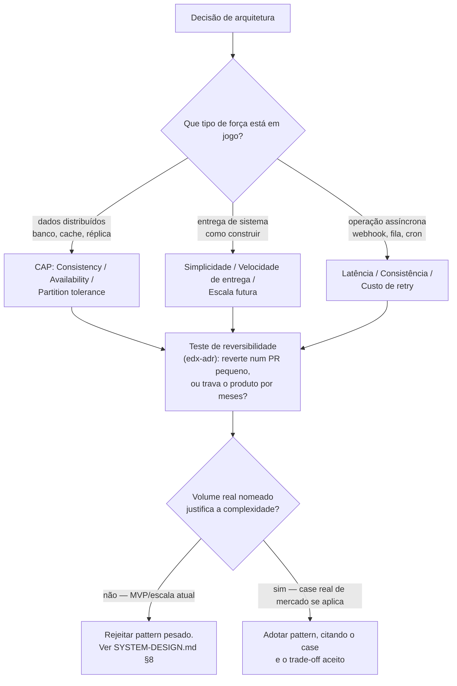

# RFC: Dar corpo de conhecimento de system design ao agente `system-architect`

**Status:** Aprovado e implementado
**Data:** 2026-08-22
**Autor:** Rafael Camillo / Impact X

> 📌 Este RFC nasceu de uma tarefa aparentemente simples (desenhar o system design big-picture do Education Hub em Mermaid) que revelou uma lacuna estrutural: o time de agentes de engenharia não tem um agente que **sabe arquitetar** — só um que verifica arquivos e produz ADR.

---

## 1. Contexto

O pedido original era desenhar o system design do Education Hub em Mermaid. Antes de desenhar, ao perguntar se as skills do `superpowers` já cobriam "patterns e anti-patterns de arquitetura", a resposta foi não — e a investigação seguinte expôs três problemas reais, não hipotéticos:

1. **`edx-adr` está órfã.** A skill de formato de ADR do Education Hub é documentada como consumida pelo `system-architect` (`~/.claude/skills/dev-workflow/SKILL.md:174`, marcada ✅ numa matriz agente↔skill), mas o corpo real de `~/.claude/agents/system-architect.md`, seção "Contexto mínimo", nunca a referencia — só lista arquivos (schema, ADRs, rules). A intenção foi documentada e nunca implementada.

2. **`engineering:system-design`** (skill de plugin de mercado, `knowledge-work-plugins`, a que abriu a sessão original) é só o esqueleto de processo — 5 passos genéricos (Requirements Gathering → High-Level Design → Deep Dive → Scale and Reliability → Trade-off Analysis), sem pattern nomeado, sem case, sem ancoragem de escala. Não é editável (plugin) e não resolve o problema de conteúdo.

3. **O `system-architect` não sabe arquitetar.** Comparado aos outros 9 agentes de engenharia (`code-explorer`, `feature-architect`, `code-implementer`, `test-writer`, `debugger`, `code-reviewer`, `security-auditor`, `silent-failure-hunter`, `product-manager`) — todos com as mesmas 7 seções (`Escopo`/`Nunca faz`/`Contexto mínimo`/`Tools`/`Model tier`/`Contrato de saída`/`Coordenação`) — o `system-architect` bate na estrutura, mas não no conteúdo. `code-reviewer` tem uma checklist de performance por camada; `security-auditor` tem uma lista nomeada de 6 categorias OWASP que "sempre procura". `system-architect` não tem nada equivalente: nenhum pattern de mercado nomeado (CAP, sharding, saga, circuit breaker, idempotência), nenhum framework de trade-off (o "triângulo" que toda decisão de arquitetura equilibra), nenhum case real de referência, nenhuma distinção de estágio (o que é certo num MVP é over-engineering em escala e vice-versa). Ele lista arquivos e produz um ADR — não demonstra ter o julgamento de um arquiteto sênior de mercado.

Isso importa porque `system-architect` é o único agente com tier Opus dedicado a decisão irreversível (schema, tenant, contrato de pagamento, escolha estrutural de lib) — é o agente mais caro de errar, e hoje o mais raso em conhecimento de arquitetura de fato.

---

## 2. Proposta

Dar ao `system-architect` um corpo de conhecimento de system design de mercado — vocabulário de patterns consagrados, um framework de trade-off central (o "triângulo" de forças em conflito, aplicado por tipo de decisão), e cases reais reconhecidos — sem inflar o próprio arquivo do agente. O conhecimento pesado mora numa skill global nova, `system-design-patterns`, que o agente carrega obrigatoriamente antes de qualquer decisão. Junto, corrige-se o wiring órfão de `edx-adr` (mesmo mecanismo, mesma correção) e um pequeno trim de padrão (parágrafo longo sobre tools que os outros 9 agentes resolvem em bullet terso).

### Abordagens consideradas

| Abordagem | Trade-off |
|---|---|
| **A. Skill global separada + wiring no agente (recomendada)** | Mantém os 9 outros agentes como referência de tamanho enxuto; o conteúdo pesado fica isolado, versionável e reusável fora do Education Hub. Custo: mais um arquivo pra manter sincronizado. |
| B. Conteúdo direto no corpo do `system-architect.md` | Mais simples de ler de uma vez, mas quebra o padrão de tamanho dos outros 9 agentes e não é reusável por nenhum outro agente/projeto. |
| C. Editar `engineering:system-design` (o plugin) | Descartada — é plugin de mercado, sobrescrito em update; não é nosso pra editar. |

**Recomendação: Abordagem A.** É a única que resolve as três lacunas (wiring órfão, ausência de conteúdo, duplicação com plugin) sem quebrar o padrão estrutural que os outros 9 agentes já estabelecem, e o conteúdo fica reusável por qualquer projeto futuro, não só Education Hub.

---

## 3. Implementação

### Framework central: o triângulo de decisão

Toda decisão de arquitetura equilibra forças que competem — não existe pattern "certo" isolado do contexto. A skill ensina a reconhecer **qual triângulo está em jogo** antes de aplicar qualquer pattern:

O triângulo "Simplicidade / Velocidade de entrega / Escala futura" é o mais relevante hoje pro Education Hub — já está implícito no ADR-0001 (Next-só vs. NestJS) e na filosofia 37signals do produto, mas nunca foi nomeado como ferramenta reusável.

### Patterns de mercado + cases (conteúdo da skill)

| Categoria | Patterns | Case de referência |
|---|---|---|
| Dados | Sharding, read replica, CQRS, event sourcing | Instagram (ID generation por shard) |
| Consistência assíncrona | Idempotência por chave determinística, saga vs. 2PC, outbox | Stripe (idempotency keys) — direto relevante ao `externalReference` do ADR-0003 |
| Resiliência | Circuit breaker, retry com backoff exponencial, bulkhead | Netflix/Hystrix |
| Escala de leitura/tráfego | Cache-aside vs. write-through, fanout-on-write vs. fanout-on-read, rate limiting (token bucket vs. sliding window) | Twitter (timeline fanout) |
| Multi-tenancy | Isolamento por aplicação vs. RLS vs. schema-per-tenant vs. database-per-tenant | ADR-0002 do próprio Education Hub, nomeado como "isolamento por aplicação, escolhido por escala pequena" — não como única opção correta |

Anti-patterns por estágio (MVP vs. scale-up vs. milhares de usuários) usam `docs/product/SYSTEM-DESIGN.md` §8 do Education Hub como exemplo real já escrito: fila Redis/BullMQ, cache distribuído, multi-region e microserviços — todos explicitamente rejeitados no estágio atual, com nota de "revisitar se o volume nomeado mudar".

### Ordem de implementação

1. **Skill global `~/.claude/skills/system-design-patterns/SKILL.md`** — usar `superpowers:writing-skills` pro formato. Abrir declarando a relação com `engineering:system-design` (usa o esqueleto de processo daquela skill; esta preenche "Trade-off Analysis" e "Scale and Reliability" com patterns nomeados, o triângulo de decisão, e cases). Conteúdo: triângulo(s) de decisão, patterns por categoria com trade-off e case (tabela acima), anti-patterns por estágio, ponteiro (não cópia) para `.claude/rules/{backend,database,infra,frontend}.md` do Education Hub, fechamento apontando pra `edx-adr` como formato de registro.
2. **Corrigir wiring em `~/.claude/agents/system-architect.md`** — seção "Contexto mínimo": adicionar, de forma imperativa, carregar via `Skill` antes de propor qualquer decisão: `edx-adr` (formato de saída) + `system-design-patterns` (vocabulário/framework/cases). Anotar que corrige o mesmo bug documentado-mas-nunca-amarrado de `dev-workflow:174`.
3. **Trim de padrão no mesmo arquivo** — linhas 28-37 (parágrafo longo sobre `context7`/`supabase` fora do array `tools:`) comprimidas pra 1 linha, no estilo terso dos outros 9 agentes.
4. *(próxima etapa, fora deste RFC)* Diagramas Mermaid do estado real do Education Hub (`docs/architecture/system-design-atual.md`) — componentes big-picture + fluxo de cobrança mensal, marcando ✅ construído vs. ❌ faltando, usando o `system-architect` já parrudo como referência de julgamento pros diagramas.

---

## 4. Riscos e Alternativas

- **Risco — a skill vira enciclopédia em vez de vocabulário aplicável.** Mitigação: profundidade fixada em "vocabulário + framework de decisão + 1-2 cases curtos por tema" (decisão já confirmada via pergunta direta) — não cobertura tipo livro de referência.
- **Risco — conteúdo escrito de memória solta, cases genéricos ou imprecisos.** Mitigação: os 5 cases citados (Stripe, Netflix/Hystrix, Instagram, Twitter, e o ADR-0002 do próprio produto) são casos reais e amplamente documentados no mercado, não inventados; ao escrever a skill, cada case deve manter a atribuição correta e o mecanismo real (não uma versão simplificada a ponto de ficar errada).
- **Risco — o agente cresce e quebra o padrão de tamanho dos outros 9.** Mitigação: é exatamente o que a Abordagem A evita — o corpo do agente ganha só o wiring (2 linhas) e o trim (economia líquida), o peso todo fica na skill separada.
- **Alternativa descartada — editar `engineering:system-design`:** é plugin de mercado, não nosso; mudanças seriam sobrescritas em update e não é o lugar certo pra conteúdo específico de patterns de mercado + trade-offs de produto.
- **Alternativa descartada — conteúdo direto no corpo do agente:** mais simples de ler numa passada, mas quebra a paridade estrutural com os outros 9 agentes e não é reusável fora do `system-architect`.

---

## Ver também

- `~/.claude/skills/dev-workflow/SKILL.md` (matriz agente↔skill, linha 174 — a origem do achado de wiring órfão)
- `docs/decisions/ADR-0001-nextjs-monolito.md`, `ADR-0002-multitenancy-por-aplicacao.md`, `ADR-0003-asaas-cliente-tipado.md` (Education Hub) — casos reais já resolvidos que a skill nova referencia
- `docs/product/SYSTEM-DESIGN.md` §8 (Education Hub) — fonte dos anti-patterns por estágio

*Implementado em 2026-08-22: `~/.claude/skills/system-design-patterns/SKILL.md` criada (global, fora deste repo); `~/.claude/agents/system-architect.md` corrigido (wiring de `edx-adr` + `system-design-patterns`, trim de padrão). Próximo passo (item 4, fora deste RFC): diagramas Mermaid do estado real do Education Hub.*
